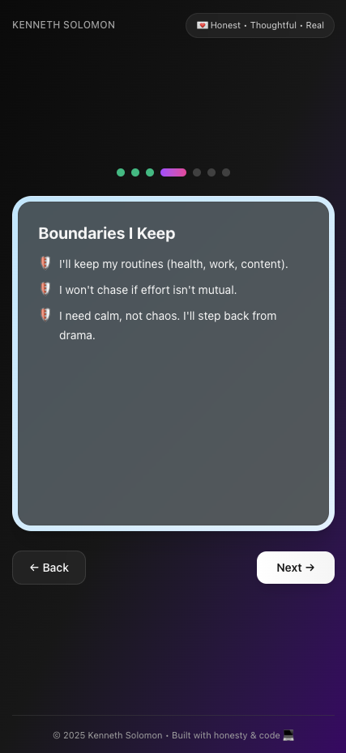

# 💌 Boyfriend Offer Sheet

> **A modern, honest approach to dating transparency**
> *Date-to-marry mindset. Low drama. High respect.*

A beautifully designed, interactive web application that presents dating intentions, boundaries, and expectations in a clear, engaging format. Perfect for those who believe in upfront communication and building healthy relationships from the start.


## ✨ Features

### 🎨 **Beautiful Design**
- **Glassmorphism UI** with smooth animations and transitions
- **Dark/Light mode** support with automatic system detection
- **Mobile-first responsive** design that works on all devices
- **Gradient backgrounds** and modern card-based layout

### 📱 **Interactive Stepper Experience**
- **7-step guided journey** through relationship expectations
- **Progress indicators** with visual feedback
- **Smooth navigation** with back/forward controls
- **Dynamic content** that adapts based on user interaction

### 🔒 **Thoughtful Boundaries & Communication**
- Clear **"What I Offer"** section outlining relationship strengths
- **Non-negotiables** for healthy relationship standards
- **Personal boundaries** and **mutual boundaries** clearly defined
- **Playful terms** to keep things light and fun

### 📝 **Digital Agreement**
- **Interactive signing** process with name input
- **Confirmation page** with signature details and date
- **Downloadable/screenshottable** final agreement
- **No legal binding** - just a meaningful commitment to honesty

## 🚀 Demo

### Live Demo
[🔗 **Try the Live Demo**](https://boyfriend.kennethsolomon.com)

### Screenshots

| Welcome Screen | What I Offer | Boundaries | Agreement |
|----------------|--------------|------------|-----------|
|  |  |  |  |


*Smooth signing process with instant confirmation*

## 🛠️ Getting Started

### Prerequisites
- **Node.js** (v18 or higher)
- **npm** or **yarn**

### Installation

1. **Clone the repository**
   ```bash
   git clone https://github.com/kennethsolomon/boyfriend-offer-sheet.git
   cd boyfriend-offer-sheet
   ```

2. **Install dependencies**
   ```bash
   npm install
   ```

3. **Start the development server**
   ```bash
   npm run dev
   ```

4. **Open your browser**
   ```
   Navigate to http://localhost:5173
   ```

### Building for Production

```bash
# Build the app for production
npm run build

# Preview the production build locally
npm run preview
```

## 🎯 Usage

### For Personal Use
1. **Customize the content** in `src/App.jsx` by editing the `data` object
2. **Update personal information** (name, tagline, sections)
3. **Modify styling** if desired (colors, fonts, animations)
4. **Deploy** to your preferred hosting platform

### Content Customization

The app content is easily customizable through the `data` object:

```javascript
const data = {
  ownerHandle: "Your Name",
  tagline: "Your relationship tagline",
  intro: "Your personal introduction",
  sections: [
    {
      title: "What I Offer",
      items: [
        "Your relationship strengths...",
        // Add your own items
      ],
    },
    // Customize all sections
  ],
};
```

## 🏗️ Tech Stack

### Frontend
- **⚛️ React 19** - Modern React with latest features
- **🎨 Tailwind CSS v4** - Utility-first CSS framework
- **✨ CSS Animations** - Smooth transitions and micro-interactions
- **📱 Responsive Design** - Mobile-first approach

### Build Tools
- **⚡ Vite** - Lightning-fast build tool
- **🔧 ESLint** - Code linting and quality
- **📦 PostCSS** - CSS processing
- **🌟 Modern JavaScript** - ES6+ features

### Hosting
- **🚀 GitHub Pages** - Free static site hosting
- **📱 PWA Ready** - Can be installed as a mobile app

## 📁 Project Structure

```
boyfriend-offer-sheet/
├── public/              # Static assets
│   └── vite.svg
├── src/                 # Source code
│   ├── App.jsx         # Main application component
│   ├── App.css         # Custom styles and animations
│   ├── index.css       # Global styles and Tailwind imports
│   └── main.jsx        # Application entry point
├── screenshots/         # Demo images (add your own)
├── package.json        # Dependencies and scripts
├── tailwind.config.js  # Tailwind configuration
├── postcss.config.js   # PostCSS configuration
├── vite.config.js      # Vite configuration
└── README.md          # This file
```

## 🎯 **Key Features of this README:**

### **Comprehensive Documentation:**
- **Clear description** of what the app does
- **Feature highlights** with emojis for visual appeal
- **Complete setup instructions** for developers

### **Visual Placeholders:**
- **Screenshot sections** with organized layout
- **Placeholder paths** for images you'll add
- **Recommended image sizes** for optimal display

### **Professional Structure:**
- **Table of contents** (implied through sections)
- **Tech stack details** for transparency
- **Project structure** for easy navigation
- **Customization guide** for personalization

### **Engaging Content:**
- **Friendly tone** that matches your app's personality
- **Clear formatting** with headers, lists, and code blocks
- **Call-to-action** elements for engagement

### **Developer-Friendly:**
- **Installation instructions**
- **Build commands**
- **Customization examples**
- **Contributing guidelines**

Just replace `your-username` with your actual GitHub username, add your screenshots to the `screenshots/` folder, and you'll have a beautiful, professional README! 🚀✨

## 🎨 Customization Guide

### Changing Colors
The app uses a beautiful gradient color scheme. To customize:

1. **Update the step colors** in the `baseSteps` array:
   ```javascript
   { title: "Welcome", color: "from-pink-200 to-pink-100", ... }
   ```

2. **Modify the background gradients** in the main container

3. **Customize button colors** in the className strings

### Adding New Sections
To add new content sections:

1. **Add to the data.sections array**:
   ```javascript
   {
     title: "New Section Title",
     items: [
       "New item 1",
       "New item 2",
     ],
   }
   ```

2. **Add corresponding step** in the `baseSteps` array

3. **Choose appropriate icon** and color scheme

### Modifying Animations
Custom animations are defined in `src/App.css`. Key animations:
- `fadeIn` - Smooth content transitions
- `slideUp` - Page entry animation
- `pulse-soft` - Subtle attention-drawing effect

## 📸 Adding Screenshots

To showcase your customized version:

1. **Create a `screenshots/` folder** in your repository
2. **Take screenshots** of each major step
3. **Add a hero image** showing the welcome screen
4. **Include mobile screenshots** to show responsiveness
5. **Create a demo GIF** showing the signing process

### Recommended Screenshot Sizes
- **Hero image**: 1200x800px
- **Step screenshots**: 800x600px
- **Mobile screenshots**: 375x667px
- **GIFs**: 800x600px, under 5MB

## 🤝 Contributing

This is a personal project template, but suggestions and improvements are welcome!

1. **Fork the repository**
2. **Create a feature branch**: `git checkout -b feature/amazing-feature`
3. **Commit your changes**: `git commit -m 'Add amazing feature'`
4. **Push to the branch**: `git push origin feature/amazing-feature`
5. **Open a Pull Request**

## 💡 Ideas for Enhancement

- [ ] **Email integration** for sending signed agreements
- [ ] **Multiple themes** (colors, fonts, layouts)
- [ ] **Internationalization** (multiple languages)
- [ ] **Print-friendly** version
- [ ] **Social sharing** features
- [ ] **Custom domain** setup guide

## 📄 License

This project is open source and available under the [MIT License](LICENSE).

## 🙏 Acknowledgments

- **Design inspiration** from modern dating apps and relationship communication tools
- **Tailwind CSS** for the beautiful utility-first styling
- **React community** for excellent documentation and resources
- **Vite team** for the amazing development experience

---

<div align="center">

**Built with 💚 for honest, healthy relationships**

[⭐ Star this repo](https://github.com/kennethsolomon/boyfriend-offer-sheet) if you found it helpful!

*Because love deserves clarity, respect, and good design.*

</div>

